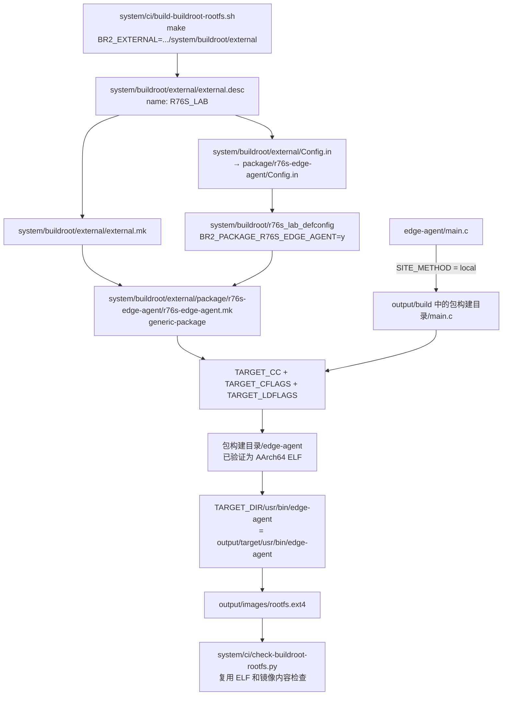

# 把 edge-agent 接入 Buildroot Package

2026-09-16 完成接线和静态检查；2026-09-17 按用户授权提交、推送和手动构建。用户要求查结果后，[运行 35174251542](https://github.com/billionsheep/r76s-robot-node/actions/runs/35174251542) 的云端与下载验收通过，提交为 `5d0373c`。edge-agent 已成为镜像内的 AArch64 ELF；没有启动该程序或验证 R76S 启动。

下一项小实验：[Package 安装 one-shot 启动脚本](13-buildroot-edge-agent-init.md)。本文保留最初 Package 接入及其构建结果，新脚本的验证状态见接续文档。

## 本次结果如何对应 diff

rootfs 任务 53 分 34 秒，构建步骤 52 分 54 秒。下载后 20 项 SHA-256 通过，rootfs 为 128 MiB，target 的 du -sh 为 7.0M。最终配置相比 overlay 基线只新增三个 external 元数据和包开关，原有选择不变。

| 提交中的文件 | 实际生效证据 |
| --- | --- |
| `.gitignore` | 新 external 文件已进入提交并被 Actions checkout；这是文件纳入版本控制的作用 |
| `external/external.desc` | `.config` 第 6–8 行出现 R76S_LAB、external 绝对路径、-g5d0373c；末尾有描述文字 |
| `external/Config.in` | 包的选项成功进入最终配置，说明配置入口已经加载 |
| `external/external.mk` | 默认构建实际执行 r76s-edge-agent 包配方，说明 .mk 已纳入构建 |
| `package/r76s-edge-agent/Config.in` | 最终 `.config` 第 4228 行和 resolved_defconfig 第 10 行保留包开关 |
| `package/r76s-edge-agent/r76s-edge-agent.mk` | build.log 第 69938–69944 行：local 同步源码、交叉编译、0755 安装到 target |
| `r76s_lab_defconfig` | 下载的输入 defconfig 与提交逐字节相同，且包选择进入最终/精简配置 |
| `build-buildroot-rootfs.sh` | configure、savedefconfig、build 均完成；external 已加载并真正构建包 |
| `check-buildroot-rootfs.py` | inspect.log 第 124 行为 ARM aarch64 ELF，第 133 行 Machine: AArch64；权限与动态加载器检查通过；inspection.txt 第 205 行从 ext4 提取程序，inspection.json 留存内容一致的哈希 |
| `10-buildroot-rootfs.md` | 实验入口与前次 overlay 验收记录，不是构建输入 |
| 本文档 | 教学和结果说明，不是构建输入 |

`BR2_EXTERNAL_NAMES/PATH/VERSION` 是 Buildroot 按构建入口自动生成的元数据，不是我们手写的新包开关。`TARGET_CFLAGS` 在日志里展开为大文件支持、`-O2 -g0 -D_FORTIFY_SOURCE=1` 等；本次 `TARGET_LDFLAGS` 没有附加参数，配方保留引用符合预期。

关键记录保存在本地 [日志摘录](../evidence/github-35174251542/edge-agent-log-excerpts.txt)、[最终配置差异](../evidence/github-35174251542/config-diff.txt)、[验收摘要](../evidence/edge-agent-package-build-001.json)。实际 ELF 与 debugfs 比对在云端执行，本地验证了下载哈希、配置和报告对应关系；未在 Mac 重新执行目标程序或提取镜像。原始日志和镜像不推送公开仓库。

源码继续使用仓库唯一的 `edge-agent/main.c`，内容不修改。下面各路径相对仓库根目录。完整改动可在本次 Package 接入的 Git 提交差异中查看；准备阶段的相关差异另存于本地 `docs/evidence/edge-agent-package-preflight/changes.diff`。

## 修改/新增文件 1

路径：`system/buildroot/external/external.desc`

它现在负责什么：给项目 external tree 命名。

为什么需要它：Buildroot 需要识别这棵扩展树，并生成可供配置和 Make 使用的路径变量。

最重要的两行：

```text
name: R76S_LAB
desc: R76S Buildroot Lab
```

这些行分别是什么意思：`name` 是机器识别名；由此生成 `BR2_EXTERNAL_R76S_LAB_PATH`，指向 external 目录的绝对路径。`desc` 是给人看的简短说明。这不是包的开关，也不执行编译。

## 修改/新增文件 2

路径：`system/buildroot/external/Config.in`

它现在负责什么：external tree 的配置入口。

为什么需要它：将包自己的配置定义接入 Buildroot 配置系统。

最重要的一行：

```kconfig
source "$BR2_EXTERNAL_R76S_LAB_PATH/package/r76s-edge-agent/Config.in"
```

这些行分别是什么意思：`source` 让 Kconfig 接着读这个文件；这里的 `source` 不是执行 Shell。它引用下面第 4 个文件，既不读取 main.c，也不调用 GCC。

## 修改/新增文件 3

路径：`system/buildroot/external/external.mk`

它现在负责什么：external tree 的 Make 入口。

为什么需要它：让 Buildroot 发现我们的包配方。

最重要的一行：

```makefile
include $(sort $(wildcard $(BR2_EXTERNAL_R76S_LAB_PATH)/package/*/*.mk))
```

这些行分别是什么意思：`wildcard` 找到 package 下一层目录内的 `.mk`，`sort` 固定加载顺序，`include` 将这些构建规则读入。当前只会引入 r76s-edge-agent.mk。

## 修改/新增文件 4

路径：`system/buildroot/external/package/r76s-edge-agent/Config.in`

它现在负责什么：定义是否将这个包加入系统的布尔选项。

为什么需要它：defconfig 中写的选项必须先有定义，Buildroot 才知道它是什么意思。

最重要的两行：

```kconfig
config BR2_PACKAGE_R76S_EDGE_AGENT
	bool "r76s-edge-agent"
```

这些行分别是什么意思：第一行定义配置名；第二行说明它是可选中的布尔项，显示名为 r76s-edge-agent。这里没有 `default y`，本项目是否启用由 defconfig 明确选择。后面的 help 说明程序只输出 uptime JSON，不设置自动启动。

## 修改/新增文件 5

路径：`system/buildroot/external/package/r76s-edge-agent/r76s-edge-agent.mk`

它现在负责什么：定义源码来源、编译命令、安装位置，并注册为 generic-package。

为什么需要它：选中包只表达意图，还需要告诉 Buildroot 怎样制造、安装这个程序。

最重要的五行（从完整文件摘取，中间的 define/endef 见源码）：

```makefile
R76S_EDGE_AGENT_SITE = $(BR2_EXTERNAL_R76S_LAB_PATH)/../../../edge-agent
R76S_EDGE_AGENT_SITE_METHOD = local
	$(TARGET_CC) $(TARGET_CFLAGS) -std=c11 -Wall -Wextra "$(@D)/main.c" -o "$(@D)/edge-agent" $(TARGET_LDFLAGS)
	$(INSTALL) -D -m 0755 "$(@D)/edge-agent" "$(TARGET_DIR)/usr/bin/edge-agent"
$(eval $(generic-package))
```

这些行分别是什么意思：

- `SITE` 从 external 目录往上三层回到仓库，再找到现有 edge-agent 目录。
- `local` 表示源码来自构建机器上的目录。Actions 先 checkout 本仓库，因此这里的“本地”指云端运行器上的仓库目录。Buildroot 会将源码同步到 output/build 中的包构建目录，保护仓库源码不被编译产物污染；package 目录没有第二份 main.c。
- `TARGET_CC` 是 Buildroot 为目标平台选择的 C 编译器。本配置使用交叉工具链，将程序生成为 AArch64 ELF；它不是 Mac 编译器，也不是运行器普通的宿主 gcc。
- `TARGET_CFLAGS` 带入目标平台的编译选项，例如优化、架构相关选项；`-std=c11 -Wall -Wextra` 明确本程序的语言标准和警告。
- `$(@D)` 是执行这条规则时的包构建目录。输入和输出都放在那里。
- `TARGET_LDFLAGS` 带入目标程序的链接选项，负责生成最终可执行文件时的链接行为。本程序没有增加额外库依赖。
- `INSTALL -D` 创建目标父目录并复制文件；`-m 0755` 设置可执行权限。`TARGET_DIR` 在本工程是云端的 `output/target`，所以安装结果是 `output/target/usr/bin/edge-agent`，不是运行器自己的 `/usr/bin/edge-agent`。
- `generic-package` 是 Buildroot 提供的包基础设施；最后的 eval 将本配方注册进去，接上源码准备、工具链依赖、编译和目标安装等阶段。前面的 BUILD_CMDS、INSTALL_TARGET_CMDS 是由它在相应阶段执行的命令块。它不会帮我们猜 main.c 的编译命令，所以命令块仍需自己写。

文件中的 `VERSION = 0.1.0` 对应现有程序版本；本地源码的实际内容由所构建的仓库提交决定。这里的 Package 是构建配方，本轮不生成 .deb，也不引入板端包管理器。

## 修改/新增文件 6

路径：`system/buildroot/r76s_lab_defconfig`

它原本负责什么：选择 AArch64、glibc、BusyBox、Dropbear、overlay 和 ext4 等。

为什么需要修改：将新包选入本项目。

最重要的一行：

```text
BR2_PACKAGE_R76S_EDGE_AGENT=y
```

这些行分别是什么意思：明确选中第 4 个文件定义的选项。其余原有配置保持不变；静态比较确认本轮只增加这一项。

## 修改/新增文件 7

路径：`system/ci/build-buildroot-rootfs.sh`

它原本负责什么：执行 prepare、configure、build、inspect、collect。

为什么需要修改：Buildroot 必须先加载我们的 external tree，才能认识新选项和配方。

最重要的四行：

```bash
BR_EXTERNAL="$ROOT/system/buildroot/external"
make -C "$BR" O="$OUT" BR2_EXTERNAL="$BR_EXTERNAL" BR2_DEFCONFIG="$ROOT/system/buildroot/r76s_lab_defconfig" defconfig
make -C "$BR" O="$OUT" BR2_EXTERNAL="$BR_EXTERNAL" BR2_DEFCONFIG="$ART/resolved_defconfig" savedefconfig
make -C "$BR" O="$OUT" BR2_EXTERNAL="$BR_EXTERNAL" BR2_JLEVEL="$(nproc)"
```

这些行分别是什么意思：第一行保存 external 绝对路径。后三行分别生成最终配置、导出精简配置、执行构建，都显式传入同一 external tree。`-C` 指定 Buildroot 源码目录，`O` 指定 output 目录。

`BR2_EXTERNAL` 是 Buildroot 构建入口变量；本项目以 Make 命令行赋值传入，也可通过环境提供。它不是写进 defconfig 的普通包开关。Buildroot 会据此加载 external.desc、Config.in、external.mk，并在输出目录保存扩展树信息。

| 写法 | 在这里回答的问题 |
| --- | --- |
| `BR2_EXTERNAL=.../external` | 到哪里加载我们的配置定义和构建规则？ |
| `BR2_PACKAGE_R76S_EDGE_AGENT=y` | 已经认识这个包后，这次系统是否选择它？ |

只写包开关却不加载 external，Buildroot 不会自动认识这个包；只加载 external 却不选中包，也不会将它加入默认系统构建。

## 修改/新增文件 8

路径：`system/ci/check-buildroot-rootfs.py`

它原本负责什么：验证最终配置、多个 ELF、镜像内容和 overlay。

为什么需要修改：将 edge-agent 加入同样的验收路径。

最重要的内容：required 配置列表增加 `BR2_PACKAGE_R76S_EDGE_AGENT`；公共 ELF 列表和动态加载器检查列表增加 `/usr/bin/edge-agent`；为它补充可执行权限断言。

```python
if name == '/usr/bin/edge-agent':
    assert path.stat().st_mode & 0o111, 'edge-agent is not executable'
```

这些行分别是什么意思：发现目标程序后检查其执行位。后续沿用原有 `file`、`readelf -h`、动态加载器检查、debugfs 提取与 SHA-256 比较；没有复制另一套检查函数，也不会启动程序。缺文件、错误架构、无执行权限、镜像缺文件或内容不同都会失败。2026-09-17 这套真实 ELF/镜像检查已经在云端通过。

## 修改/新增文件 9

路径：`.gitignore`

它原本负责什么：控制本仓库公开文件白名单。

为什么需要修改：让新的 external 配方以后能随仓库提交到云端。

最重要的一行：

```gitignore
!/system/buildroot/external/
```

这些行分别是什么意思：放行 external 目录；这条规则不参与 Buildroot 编译，也不会自动提交或推送文件。

## 数据流与验证边界

Config.in 定义“能选什么”，defconfig 选择“这次要什么”，r76s-edge-agent.mk 定义“如何构建和安装”。源码不流经 Config.in；配置支路控制源码的构建支路。



准备阶段的快速检查：Bash/Python 语法、唯一源码路径、Git 放行、defconfig 最小差异、固定版本官方 br2-external 元数据注册、Make 命令块只打印预览、缺失包开关时拒绝配置，均通过。当时未编译，证据在本地 `docs/evidence/edge-agent-package-preflight/verification.json`。后续真实云端结果见本页开头，不将静态预览和实际构建混为同一次检查。

所有工作流、Kernel/U-Boot、启动逻辑、overlay 原文件和 main.c 未改。启动后停止，直到用户要求查看结果才下载并验收。没有重新触发构建、自动启动服务、执行 edge-agent 或刷卡；板端运行仍未验证。

官方依据：[Buildroot 2026.08 external tree](https://buildroot.org/downloads/manual/manual.html#outside-br-custom)；[固定提交的 generic-package 文档](https://github.com/buildroot/buildroot/blob/d5180309b1b66ef3b8eaccca70ad69be8e0729a1/docs/manual/adding-packages-generic.adoc)。
